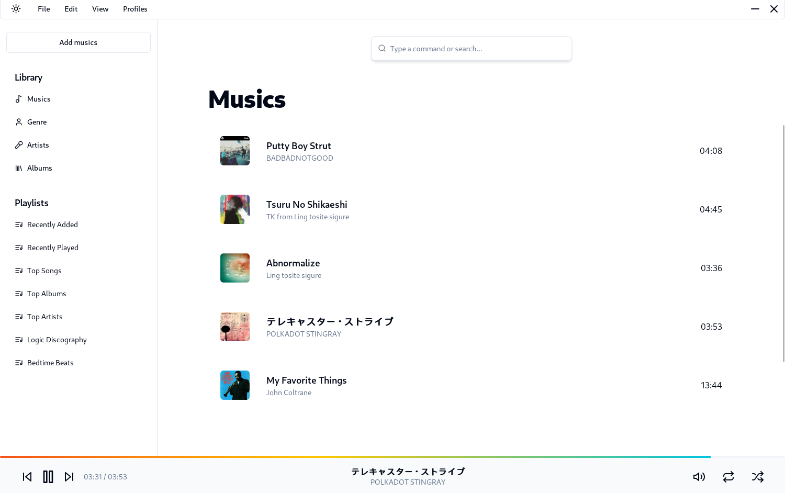

<p align="center">
    
</p>
<h1 align="center">Symfoniya</h1>
<p align="center"><strong>Music player written in Next.js and Rust.</strong></p>

## Note
This projet is still in heavy developpement and is not ready for production.

## User interface
Note: UI may vary in final production, but here are a few screenshots
### Music section


## Features
- Create playlists
- Import multiple source folder
- Download music from YouTube and Spotify
- Import playlists from YouTube and Spotify
- System queue (play next, play later, shuffle, repeat)

## Getting Started

### Running development server and use Tauri window

After cloning for the first time, set up git pre-commit hooks:

```shell
pnpm prepare
```

To develop and run the frontend in a Tauri window:

```shell
pnpm dev
```

This will load the Next.js frontend directly in a Tauri webview window, in addition to
starting a development server on `localhost:3000`.

### Building for release

To export the Next.js frontend via SSG and build the Tauri application for release:

```shell
pnpm build
```

Please remember to change the bundle identifier in
`tauri.conf.json > tauri > bundle > identifier`, as the default value will yield an
error that prevents you from building the application for release.

### Source structure

Next.js frontend source files are located in `src/` and Tauri Rust application source
files are located in `src-tauri/`. Please consult the Next.js and Tauri documentation
respectively for questions pertaining to either technology.

## Caveats

### Static Site Generation / Pre-rendering

Next.js is a great React frontend framework which supports server-side rendering (SSR)
as well as static site generation (SSG or pre-rendering). For the purposes of creating a
Tauri frontend, only SSG can be used since SSR requires an active Node.js server.

Using Next.js and SSG helps to provide a quick and performant single-page-application
(SPA) frontend experience. More information regarding this can be found here:
https://nextjs.org/docs/basic-features/pages#pre-rendering


