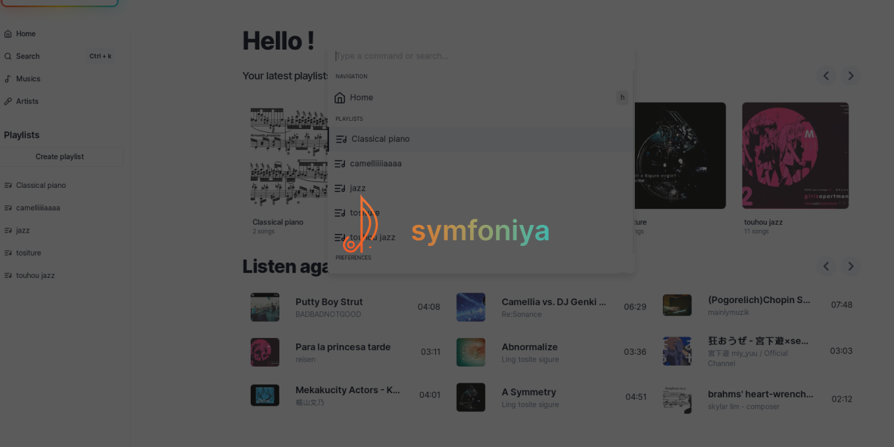
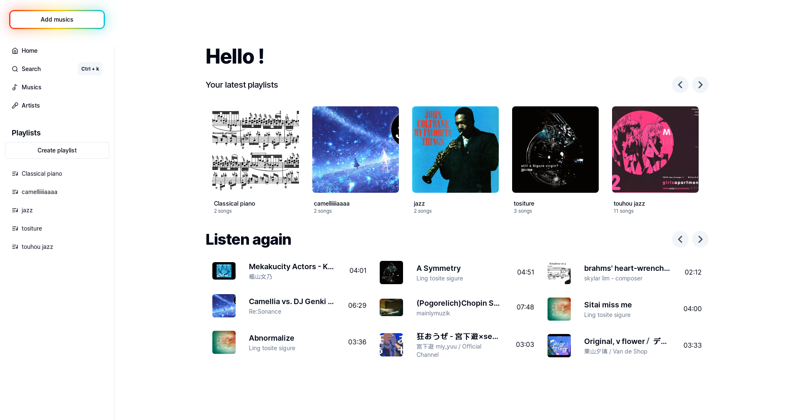
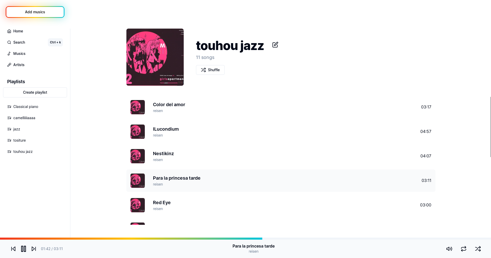
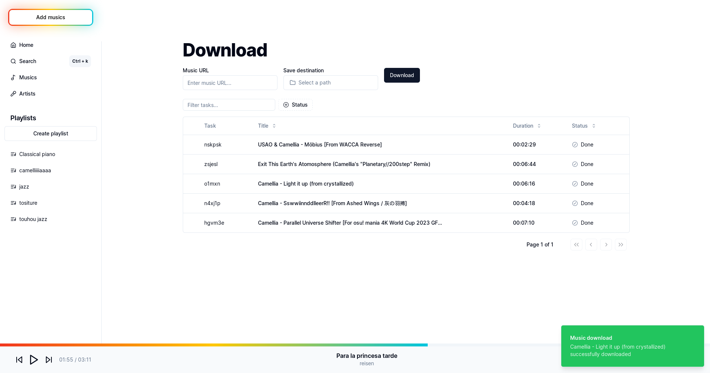
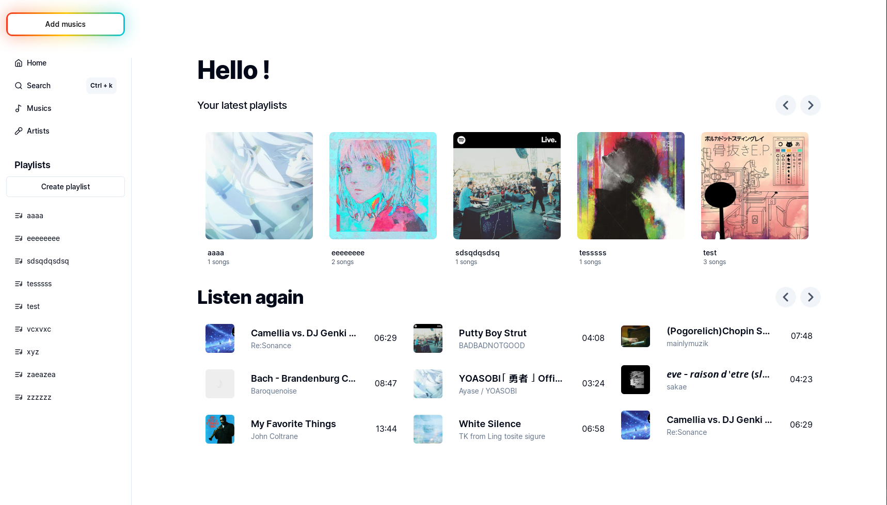

# symfoniya
Simple player and music downloader



### Why another music player ?
This project is mainly for testing out new technologies (Tauri, Rust, TypeScript / React), put in practise my old design skills and for fun of course !

### Features
- Create playlists
- Import multiple source folder
- System queue (play next, play later, shuffle, repeat)
- Seeking support ([big thanks to dvdsk for implementing this on rodio !](https://github.com/RustAudio/rodio/pull/513))
- Nav button for playlists in Home screen (using [Flicking](https://naver.github.io/egjs-flicking/))
- Search bar with shortcuts
- Download music from YouTube, Soundclound (and maybe others but haven't tested, using [youtube-dl-rs](https://github.com/GyrosOfWar/youtube-dl-rs))

### Gallery
#### Home

#### Playlist

#### Download

#### KBar


## Installation
Get the latest version in tags, or build it yourself (see below)

## Development

### Running development server and use Tauri window

After cloning for the first time, set up git pre-commit hooks:

```shell
pnpm prepare
```

To develop and run the frontend in a Tauri window:

```shell
pnpm dev
```

This will load the Next.js frontend directly in a Tauri webview window, in addition to
starting a development server on `localhost:3000`.

### Build

```shell
pnpm build
```

### Source structure

Next.js frontend source files are located in `src/` and Tauri Rust application source
files are located in `src-tauri/`. Please consult the Next.js and Tauri documentation
respectively for questions pertaining to either technology.

## Credits

### Tools
- [Tauri](https://tauri.app/)
- [Rust](https://www.rust-lang.org/)
- [TypeScript](https://www.typescriptlang.org/)
- [Next.js](https://nextjs.org/)

### Libraries
- [shadcn](https://ui.shadcn.com/)
- [Flicking](https://naver.github.io/egjs-flicking/)
- [rodio (thanks to @dvdsk for implementing seeking)](https://github.com/RustAudio/rodio/pull/513)
- [youtube-dl-rs](https://github.com/GyrosOfWar/youtube-dl-rs)
- [file-format](https://github.com/mmalecot/file-format)


### Helpers
- @FranckG28 for solving css issues


